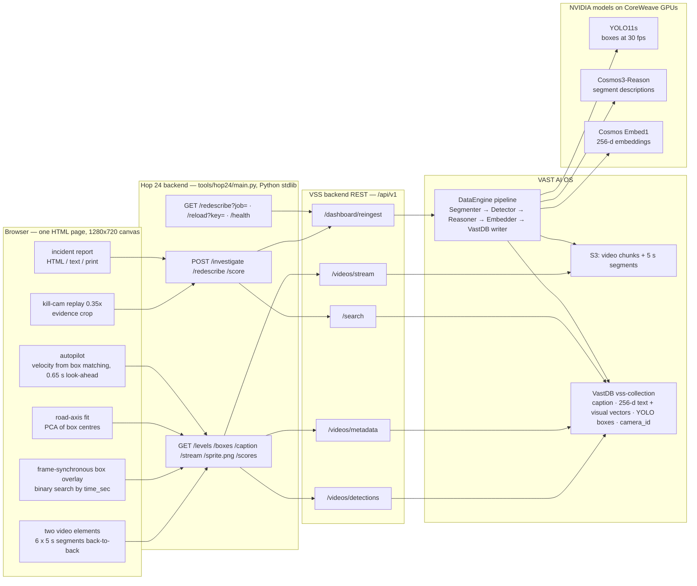
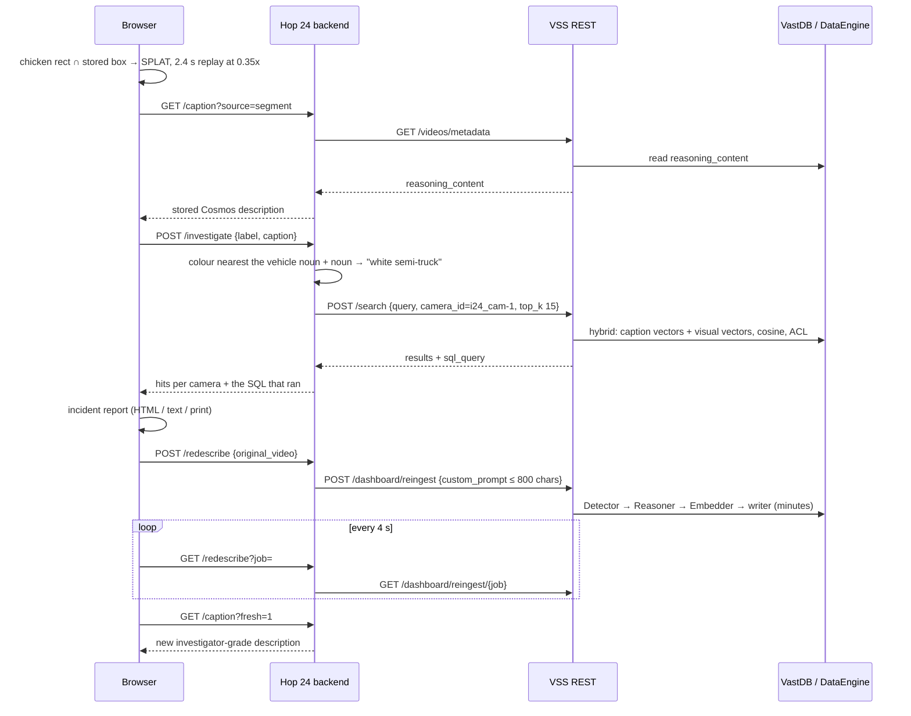
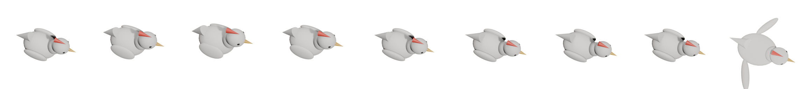

<p align="center">
  
</p>

<h1 align="center">Hop 24</h1>
<p align="center"><b>Cross a real highway. When a truck gets you, the archive finds it on every other camera.</b></p>

Hop 24 is a video agent disguised as an arcade game. You play a 3D-rendered chicken crossing a real
30-second clip from the I-24 corridor in Nashville. Every collision is decided by the YOLO11 detections
the VAST DataEngine pipeline already stored in VastDB, not by anything we drew. When a vehicle hits you,
the agent reads the segment's stored Cosmos description, builds a query from it, runs one hybrid
(caption-vector + visual-vector) search across every highway camera in the archive, files an incident
report with the evidence frame and the exact VastDB SQL it ran, and can send the clip back through the
DataEngine pipeline with an investigator's prompt so the next search is sharper. An autopilot mode lets
the agent cross on its own, using only the stored detections and no knowledge of the future.

<p align="center">
  
  
  
  
  
  
  
  
</p>

## Play it

| Where | URL |
|---|---|
| Public proxy | https://team-10-app.thecosmoslabs.com/app/ |
| Venue network | http://video-lab-team-10.cosmos.vastdata.com/app |

Pick a camera chip (`scene1_p1c1`, `p1c2`, `p1c3`) and a chunk, then:

| Key | Action |
|---|---|
| `Space` | start (or retry after a splat / crossing) |
| `← ↑ ↓ →` | hop along the fitted road axis (`↑` toward the far shoulder, 8 hops across) |
| `A` | autopilot: the agent crosses by itself |
| `B` | toggle the stored YOLO boxes |
| `C` | calibrate the road edges by hand (click near edge, then far edge; saved per camera) |
| `R` | retry in the current mode |
| `Esc` | close the incident report |

The video streams through our backend, so the VSS JWT never reaches the browser.

## What happens (30 seconds)

<table>
<tr>
<td width="50%" valign="top">
<b>1. Splat.</b><br>
The chicken rectangle intersected a stored YOLO box (here a <code>truck</code>). The collision came from the detections sidecar, frame-synchronous with the video. The stage shakes, the run is scored.<br><br>

</td>
<td width="50%" valign="top">
<b>2. Kill-cam.</b><br>
The last 2.4 s replay at 0.35x, letterboxed, with the killer's class tracked in red. A cropped evidence frame is saved with camera, segment, time, class and confidence burned in, and the segment's stored Cosmos description is read from VastDB.<br><br>

</td>
</tr>
<tr>
<td width="50%" valign="top">
<b>3. Manhunt.</b><br>
The backend takes the colour word nearest the vehicle noun in the stored caption, builds a query such as <code>white semi-truck</code>, and runs one <code>/search</code> with <code>camera_id = i24_cam-1</code>. Hits are grouped per camera in a corridor view; the strongest sighting on another camera is highlighted; the VastDB SQL is shown; click a sighting to watch it.<br><br>

</td>
<td width="50%" valign="top">
<b>4. Incident report.</b><br>
Generated client-side from what the agent gathered: event, camera and time, detection with bbox, archive description, query issued, sightings on other cameras, last seen, recommended action, evidence frame, SQL. Download as HTML, copy as text, or print.<br><br>

</td>
</tr>
</table>

Then **Sharpen the archive** re-describes the chunk through the DataEngine pipeline with an investigator's
prompt (vehicle type, colour, lane number, direction, trailer, lane changes with times) and "Re-read caption"
shows the new description. This takes minutes, so it is pre-run before a demo.

## Why this is a video agent, not a game

The organisers' win line was **problem → archive → search across cameras → action**. Hop 24 is that
line, with a game as the trigger:

| Step | In Hop 24 | What backs it |
|---|---|---|
| Problem | A pedestrian (the chicken) is struck; the vehicle does not stop | The collision is staged, but the striking vehicle, its class, confidence, bbox, camera, segment and time are all real detections |
| Archive | The agent reads what the pipeline already knows about that segment | Cosmos3-Reason caption via `/videos/metadata`, YOLO boxes via `/videos/detections`, Embed1 vectors in VastDB |
| Search across cameras | One hybrid query over every highway camera, results grouped per camera | `/search` with `metadata_filters.camera_id`; the SQL it ran (two cosine-distance branches, text weight 0.60) is shown verbatim |
| Action | File the incident report; re-describe the clip so the next search can answer "which lane" | Client-side report; `/dashboard/reingest` with an 800-char investigator prompt |

The game is there because the room laughs at the chicken and gasps at the kill-cam; everything after the
splat is the agent doing an investigator's job over the archive.

## Architecture



Three things worth noticing:

- **The browser never talks to the VSS backend.** `main.py` logs in, keeps the JWT, re-logs on 401, and
  proxies `/videos/stream` with `Range` pass-through so the two `<video>` elements can seek.
- **Everything the agent reads was produced by the pipeline before the game started.** Boxes, captions and
  vectors come from VastDB; the only thing Hop 24 writes back is a re-ingest job.
- **The backend is ~570 lines of standard library** (`http.server`, `urllib`, `json`, `re`, `threading`).
  It runs unchanged from a Kubernetes ConfigMap on `python:3.12-slim`, no Docker build.

### Kill → manhunt → report → re-describe



### Backend routes (`tools/hop24/main.py`)

| Route | What it does | Upstream |
|---|---|---|
| `GET /` | serves `index.html` | — |
| `GET /health` | `{status, mock, file}` | — |
| `GET /levels` | pages through `/videos/explore`, keeps filenames matching `scene*_p*c*`, returns 3 cameras x 10 chunks with ordered segment URIs (cached 10 min) | `/videos/explore` |
| `GET /boxes?source=` | normalises the detections sidecar to `{frames:[{t, b:[[label, conf, [x1,y1,x2,y2]]]}], shape, count}`; votes on xyxy vs xywh and normalised vs pixel coordinates | `/videos/detections` |
| `GET /stream?source=` | `Range` pass-through proxy; retries login once on 401 | `/videos/stream` |
| `GET /caption?source=&fresh=1` | `reasoning_content` of a segment; `fresh=1` bypasses the cache | `/videos/metadata` |
| `GET /sprite.png` | the Blender sprite sheet | — |
| `GET /scores` / `POST /score` | in-memory scoreboard, last 20 runs | — |
| `POST /investigate` | builds the query from label + caption, runs one hybrid search with `camera_id = i24_cam-1`, `top_k 15`, `min_similarity 0.15`; returns hits, per-hit camera, and the SQL | `/search` |
| `POST /redescribe` | starts a re-ingest of one chunk with the investigator prompt | `/dashboard/reingest` |
| `GET /redescribe?job=` | polls the job (`indexed_segments / total_segments`) | `/dashboard/reingest/{job}` |
| `GET /reload?key=` | downloads `main.py`, `index.html`, `sprite.png` from GitHub into `/tmp/hop24` and re-execs | raw.githubusercontent.com |

### Sponsor technology in Hop 24

| Technology | What it does here | Honest status |
|---|---|---|
| **VAST AI OS / S3** | holds the 30 s chunks and 5 s segments the game streams | used via `/videos/stream` |
| **VAST DataEngine** | the serverless pipeline (Segmenter → Detector → Reasoner → Embedder → VastDB writer) that produced every box, caption and vector; re-run by "Sharpen the archive" | used via `/dashboard/reingest` |
| **VastDB** | `vss-collection` table: per-segment caption, 256-d text + visual vectors, YOLO boxes, `camera_id` metadata; the hybrid search runs as SQL against it | read via `/videos/detections`, `/videos/metadata`, `/search` |
| **YOLO11s** | the per-frame boxes (150 frames per 5 s segment) that are the game's collision geometry and the autopilot's input | consumed from the archive |
| **NVIDIA Cosmos3-Reason** | wrote each segment's description; the agent reads it to build the manhunt query | consumed from the archive; not called directly |
| **NVIDIA Cosmos Embed1** | the 256-d text and video embeddings the hybrid search ranks on | consumed through `/search` |
| **CoreWeave** | the GPUs all three models run on | indirect |
| **NVIDIA Canary-1B ASR** | available on the stack | not used |
| **W&B Inference / Weave** | the stack's app LLM and tracing | not used (see next steps) |
| **Blender (Eevee)** | rendered the chicken sprite sheet | offline, at build time |

## The physics is the archive

Nothing in the game is hand-placed. The road, the cars and the deaths all come out of the detections table.

**Road axis from the detections (PCA).** `autoRoad()` takes every third frame of every segment's boxes,
drops `person`, and collects box centres in canvas coordinates. The 2x2 covariance of those centres gives
the traffic direction `d` (`θ = ½·atan2(2·sxy, sxx − syy)`) and the normal `n`, flipped to point up-screen.
Each centre is projected onto `n` with ± 0.8 x its half-diagonal; the 1st percentile of the low projections
and the 99th percentile of the high ones are the near and far road edges. The chicken spawns just outside
the near edge at the point of that line that is centred in the frame; the goal is the far edge, clamped to
what the chicken can actually reach without leaving the frame. One chunk gives 9,294 boxes to fit from.
If a camera needs a hand correction, `C` lets you click the two edges, and the fit is saved per camera in
`localStorage`.

**Collision from stored boxes.** Each `requestAnimationFrame`, the current frame's boxes are found by binary
search on `time_sec` against the active `<video>`'s `currentTime`, so the overlay never drifts from the
footage. The chicken is a 44 x 44 canvas rectangle; if it intersects any non-`person` box, it dies, with
the label and confidence of that box. There is a grace period until the first hop. The sidecars are
30 fps, 150 frames per 5 s segment, 1920 x 1080 pixel `[x1, y1, x2, y2]` boxes scaled to the canvas.

**Eight hops across.** The crossing is `(pmax − pmin) / 8` per `↑`, so a crossing is 8 hops wherever
the road sits in the frame and at whatever angle the pole camera looks at it.

**Autopilot: velocity estimation with a no-peeking rule.** The agent only sees the boxes of the frame
currently on screen, never a future frame.

1. Each box is matched to the nearest box in the previous frame (within `max(70 px, box width)`), label-agnostic,
   so a semi that flickers between `truck` and `bus` keeps one track.
2. Velocity is `Δcentre / Δt` when the match is 0.02–0.4 s old, blended 50/50 with the previous estimate.
   Boxes with no estimate yet are assumed to move at highway speed (900 canvas px/s) along `d` toward the chicken.
3. Every box is extrapolated 0.65 s ahead in 7 steps. A cell is "dangerous" if any extrapolated box
   overlaps it with a 16 px margin.
4. Rules, in order: wait 0.45 s at the start to watch the traffic; at most one hop every 0.26 s; hop if the
   next cell is clear for 0.65 s; otherwise, if the agent's own cell is threatened and the cell behind is
   clear, dodge back; otherwise hold. The reasoning is printed live in the "thought" line
   (`hold · bus crossing the next lane at 812 px/s, there in 0.3s`).

It is not scripted: in testing the agent crossed `chunk_0003` in 2.2 s on one run and was killed by a semi
(labelled `bus`, 74 %) at 2.4 s on another.

## Blender

<p align="center"></p>

`blender/chicken.py` is a headless `bpy` script:

```bash
/Applications/Blender.app/Contents/MacOS/Blender -b --python blender/chicken.py -- /tmp/chicken
```

It builds the bird from primitives (spheres for body, neck, head, wings, eyes; cones for tail, comb, wattle,
beak, legs) with Principled BSDF materials, a steep tracking camera like a pole camera, a sun key and an
area fill, then keyframes an 8-frame hop cycle (body lift and pitch, leg swing, wing flap) and renders each
frame with Eevee at 256 px on a transparent background. A ninth frame is the splat: the root scaled to
`(1.25, 1.35, 0.3)` with the wings splayed. The nine PNGs are packed into `docs/img/chicken_sheet.png`
(2304 x 256) and downscaled to `tools/hop24/sprite.png` (1440 x 160, 160 px per frame). In the game the
sprite is rotated to face the far side, drawn over a soft shadow ellipse, and frame `8` is shown on death.

## Run locally

Requirements: Python 3.12+. No packages.

**Mock mode** (synthetic footage rendered once by `ffmpeg`, four lanes of coloured rectangles whose boxes
follow the same equations):

```bash
HOP24_MOCK=1 PORT=8080 python3 tools/hop24/main.py
# open http://localhost:8080/
```

Mock mode also fakes `/investigate`, `/redescribe` (completes after ~18 s) and the fresh caption, so the whole
flow can be rehearsed without the cluster.

**Real footage offline** (`HOP24_LOCALDATA`): drop downloaded segments into a folder as `seg01.mp4` ... with
matching `seg01.json` sidecars (`{"width", "height", "frames": [{"time_sec", "boxes": [{"label",
"confidence", "bbox": [x1,y1,x2,y2]}]}]}`):

```bash
HOP24_MOCK=1 HOP24_LOCALDATA=/path/to/segments PORT=8080 python3 tools/hop24/main.py
```

**Against the VSS backend:**

```bash
VSS_URL=https://<vss-host> VSS_USERNAME=... VSS_PASSWORD=... PORT=8080 python3 tools/hop24/main.py
```

Environment variables: `PORT`, `VSS_URL`, `VSS_USERNAME`, `VSS_PASSWORD`, `HOP24_MOCK`, `HOP24_LOCALDATA`,
`HOP24_RAW` (raw GitHub dir for self-update), `HOP24_RELOAD_KEY` (default `hop`), `HOP24_AUTOUPDATE`
(default `1`: try a self-update once at start-up).

## Deploy on the team cluster

Teams build on a browser VM with the Cursor Agent CLI; apps run on Kubernetes from a ConfigMap on
`python:3.12-slim` behind an Ingress that strips `/app`. In-cluster the VSS backend is
`http://video-backend-service:8000` (the public hostname does not resolve inside the pod).

```bash
cd ~ && git clone https://github.com/vnmoorthy/hop24.git && cp -r hop24/tools/hop24 ~/vast-builders-challenge/tools/hop24
```

Then tell Cursor:

> Deploy tools/hop24 to /app with the deploy-app-no-registry skill (ConfigMap on python:3.12-slim,
> Secret VSS_URL=http://video-backend-service:8000 plus VSS_USERNAME/VSS_PASSWORD, app name hop24, port 8080).
> Confirm /app/health and /app/levels return JSON and report the output of /app/levels briefly.

### Update loop without redeploying

Push to `main`, then:

```
GET https://team-10-app.thecosmoslabs.com/app/reload?key=hop
```

The pod downloads the latest `main.py`, `index.html` and `sprite.png` from this repo into `/tmp/hop24` and
re-execs itself in place. It also tries once at start-up. If the pod has no internet access, redeploy the
ConfigMap as usual.

## Limitations

- **No true re-identification.** The manhunt returns description-similar segments ("candidate sightings"),
  not the same physical vehicle. All three cameras share `camera_id = i24_cam-1`; the per-camera grouping
  comes from the `scene1_p1c*` filename pattern.
- **The stock captions rarely say which lane.** Of 180 highway captions, 141 mention a vehicle colour, all
  mention "lane", 48 say which lane, none give a lane number. That is exactly the gap the re-describe step
  targets, and it is why the query is colour + vehicle noun rather than anything finer.
- **The collision is staged.** It is a game; the agent's job starts after the splat. The hit-and-run framing
  is a scenario, not a claim about the footage. There are no crashes in the dataset.
- **Re-describe takes minutes** through the pipeline. In a 2-minute demo it is pre-run.
- **The agent does not call W&B Inference or Cosmos directly.** Everything it reads was produced by the
  pipeline (Cosmos captions, YOLO boxes, Embed1 vectors) and read from VastDB through the VSS REST API.
- **One pole, three cameras.** The team archive holds 30 highway chunks (10 per camera) out of 414 indexed
  chunks; the rest are other packs.
- **YOLO COCO classes.** Semis sometimes read as `bus`; the autopilot is label-agnostic for this reason, and
  the report records whatever class the archive stored.
- The scoreboard is in memory and resets with the pod.

## What we would do next

- **Verify sightings with Cosmos.** Send the kill frame and each candidate segment to Cosmos3-Reason with a
  "same vehicle?" prompt, and rank the corridor view by its answer rather than by caption similarity alone.
- **Voice dispatch with Canary.** The incident report's "recommended action" read back, and an operator's
  spoken follow-up ("show me the white semi on c3") transcribed by Canary-1B into the next search.
- **Weave traces and an autopilot eval.** Log every `/investigate` and every autopilot decision to W&B Weave,
  and score the autopilot (crossings, deaths, time) across all 30 chunks as a regression suite.
- **Embed1 video-to-video.** Query `/search` with the kill segment's own visual vector instead of a text
  query, which is the right primitive for re-identification.
- **The full corridor.** Index more I-24 poles instead of the one pole of 3 cameras so "search across cameras"
  spans miles of road, not one gantry.

## Team and credits

Team 10 at the Real-Time Video Agents Hack – SF (VAST Builders Challenge), AWS Builder Loft,
2 October 2026, organised by tokens& with VAST Data. Code by [@vnmoorthy](https://github.com/vnmoorthy).

Built on the organisers' stack: VAST AI OS (S3, DataEngine, VastDB), NVIDIA Cosmos3-Reason, Cosmos Embed1
and YOLO11 served on CoreWeave, and the VSS REST backend. The I-24 footage and the VSS stack belong to the
challenge and are not part of this repository.

Files: `tools/hop24/main.py` (backend), `tools/hop24/index.html` (the page), `tools/hop24/sprite.png`,
`blender/chicken.py`, `docs/img/`.

## License

MIT.
