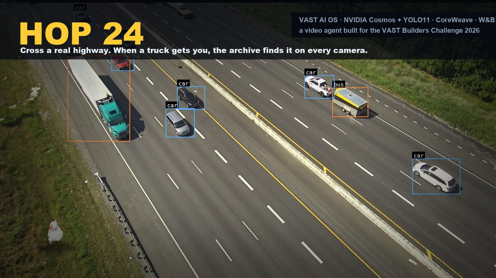
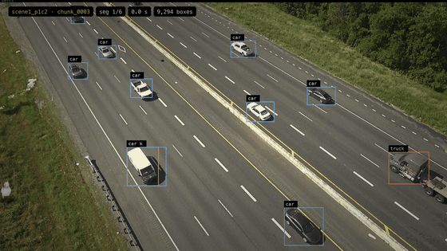
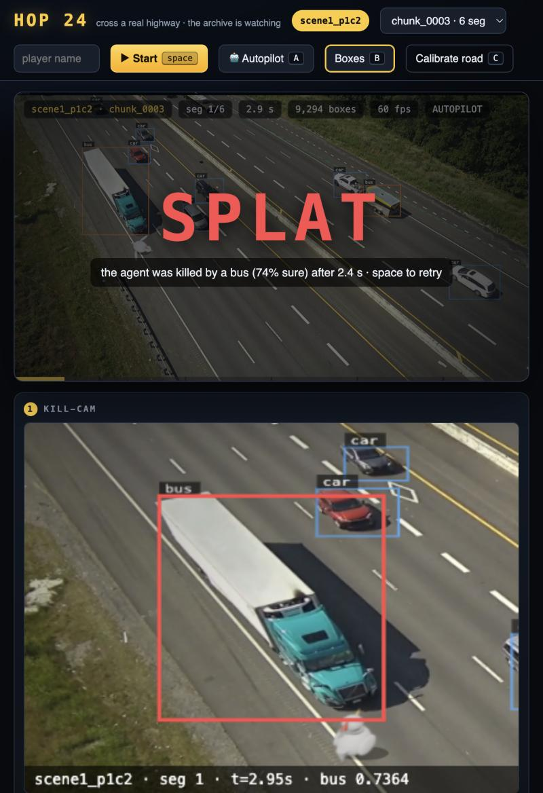
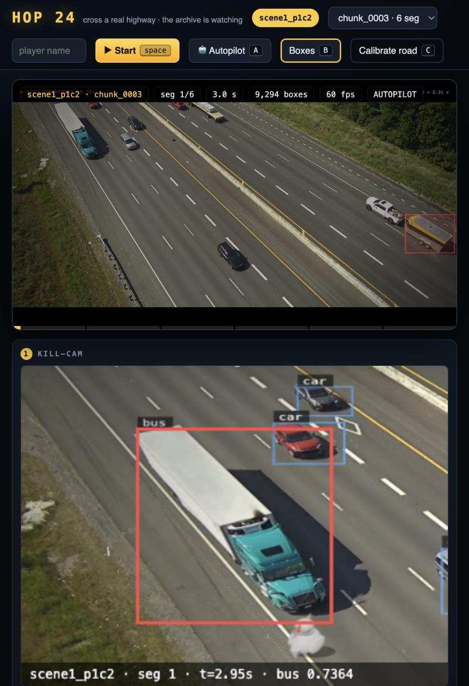
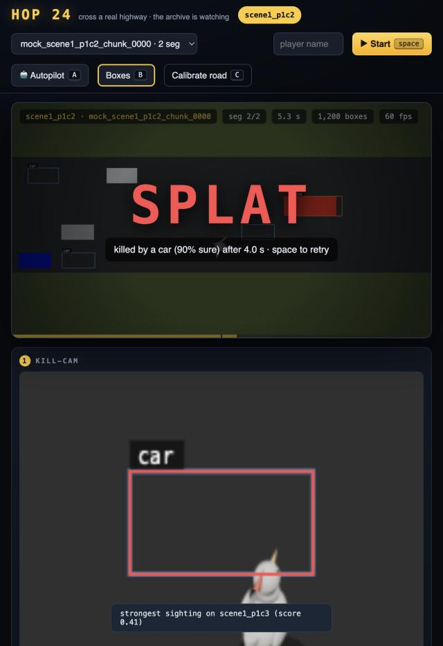
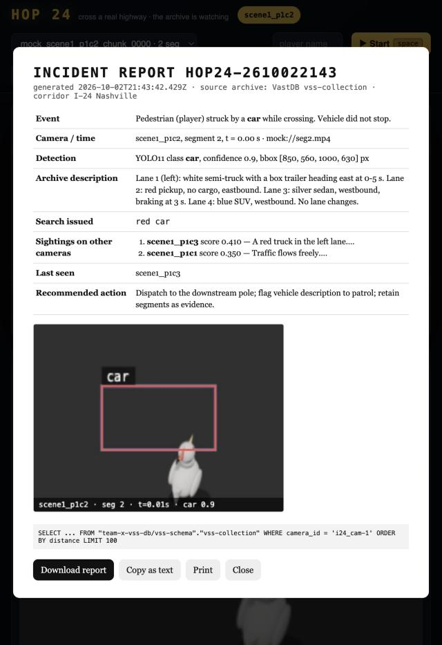
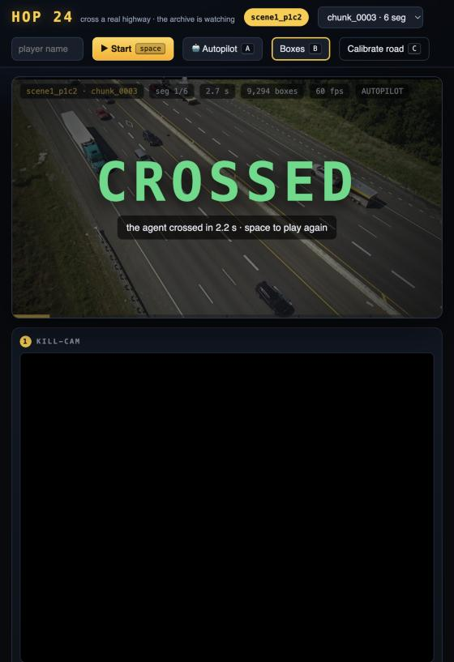
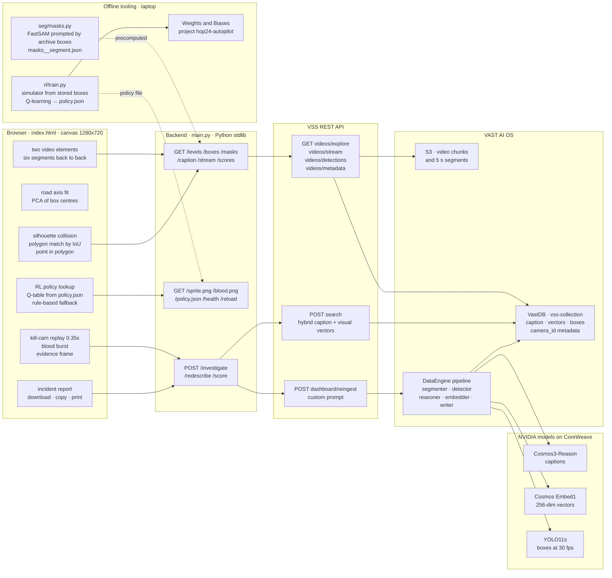
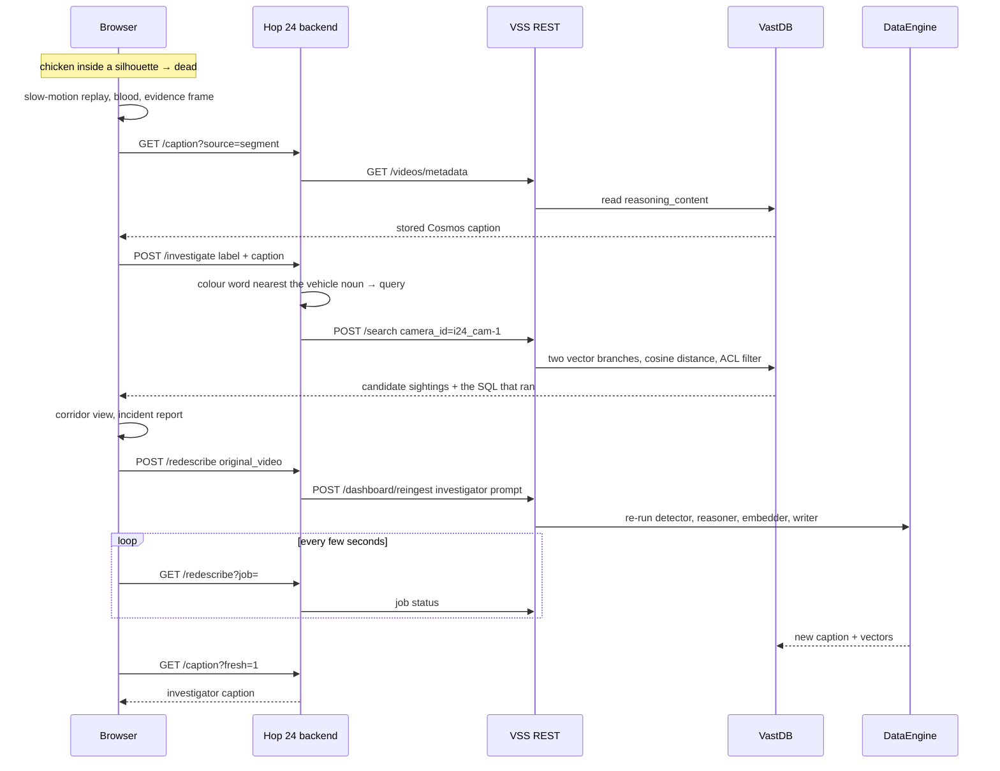

<p align="center">
  
</p>

<h1 align="center">Hop 24</h1>

<p align="center"><b>Cross a real highway as a chicken. When a truck gets you, the archive finds it on every camera.</b></p>

<p align="center">
  <a href="https://github.com/vnmoorthy/hop24/actions/workflows/ci.yml"></a>
  
  
  
  
  
  
  
  
  
  <a href="LICENSE"></a>
</p>

Hop 24 is a video agent built in one day on the VAST Builders Challenge stack. The stage is real I-24 Nashville camera footage streamed from the VAST archive; the only things we drew are two sprite sheets (a chicken and a splash of blood). Every collision comes from the archive's own YOLO11 detections, refined into vehicle silhouettes by FastSAM. When a vehicle hits you, the agent reads the stored NVIDIA Cosmos description, runs one hybrid search across every highway camera in VastDB (the "manhunt"), files an incident report, and can re-describe the clip through the DataEngine pipeline so the next search is sharper. An autopilot crosses by itself using only the stored detections, with a Q-learning policy trained on an offline simulator and tracked in Weights & Biases.

Built by Team 10 at the Real-Time Video Agents Hack – SF, 2 October 2026.

---

## Watch

<p align="center">
  
</p>

| What | Where |
|---|---|
| Trailer, 37 s, rendered from the real segments and their stored boxes | [`docs/Hop24-trailer.mp4`](docs/Hop24-trailer.mp4) |
| Animated presentation, 10 slides | https://vnmoorthy.github.io/hop24/present.html |
| Static deck, 10 slides | [`docs/Hop24-deck.pptx`](docs/Hop24-deck.pptx) |
| 3-minute storyboard with spoken lines and fallbacks | [`docs/PRESENTATION.md`](docs/PRESENTATION.md) |

The presentation is a single HTML file: `←` `→` to move, `F` for fullscreen, `L` opens the live app. Serve `docs/` with a range-capable static server (Python's `http.server` cannot seek the video).

---

- **Narrated demo video (5 min):** [`docs/Hop24-demo.mp4`](docs/Hop24-demo.mp4) — the whole presentation with voice-over; the script is [`docs/NARRATION.md`](docs/NARRATION.md) and the audio alone is [`docs/Hop24-narration.mp3`](docs/Hop24-narration.mp3).
- **Scan to play:** the first slide of the presentation is a QR code (`docs/img/qr.png`) to the public app; the live scoreboard on that slide polls `/scores`.

## Play

| Where | URL |
|---|---|
| Venue (team cluster) | http://video-lab-team-10.cosmos.vastdata.com/app |
| Public proxy | https://team-10-app.thecosmoslabs.com/app/ |

Pick a camera and a chunk, press space, reach the far shoulder.

| Key | Does |
|---|---|
| `space` | start |
| `↑` `↓` | hop one lane forward / back along the fitted road axis |
| `←` `→` | shuffle 34 px along the traffic direction |
| `A` | autopilot (RL policy, rule-based fallback) |
| `R` | retry in the same mode |
| `B` | toggle the YOLO boxes and silhouettes |
| `C` | calibrate the road edges by hand (two clicks: near edge, far edge) |
| `Esc` | close the report |

---

## What happens

### 1. Splat



The six 5-second segments of a chunk play back-to-back. The stored YOLO boxes are overlaid frame-synchronously, and inside each box a green FastSAM silhouette marks the vehicle's real outline. Death happens when any of the chicken's five body points lands inside a silhouette (or, where no silhouette exists, inside the ellipse inscribed in the box). After the replay a 12-frame blood burst plays at the point of contact and the final frame stays on the road as a stain. Deaths only count after the first hop.

### 2. Kill-cam



The last 2.4 s replay at 0.35x, letterboxed, with the killer's class tracked in red. Then a cropped evidence frame is captured with camera, segment, time, class and confidence burned in. It is re-captured about 60 ms after the blood settles so the report shows the scene as it ended.

### 3. Manhunt



The agent reads the segment's stored Cosmos caption, builds a query from the colour word nearest the vehicle noun (for example `white semi-truck`), and runs one hybrid search with `camera_id = i24_cam-1`. Results are grouped per camera in a corridor view (`p1c1 | p1c2 | p1c3`), the strongest sighting on another camera is highlighted, and the VastDB SQL the backend ran is shown. Click any sighting to watch that segment.

### 4. Incident report



Generated in the browser: event, camera and time, detection, archive description, query, sightings, last seen, recommended action, evidence frame, SQL. Download as HTML, copy as text, or print.

### 5. Autopilot



Press `A`. The agent estimates every vehicle's velocity from the last few stored boxes (no peeking at future frames), bins the time-to-impact for its own cell and its neighbours, looks the state up in a learned Q-table, and hops, holds or dodges back. The thought line shows its reasoning live. In testing it crossed `chunk_0003` in 2.2 s; on another run a semi (labelled `bus`, 74 %) got it at 2.4 s. It is honest, not scripted.

---

## Why this is a video agent, not a game

| Step | What the archive already had | What Hop 24 does with it |
|---|---|---|
| Problem | 414 chunks indexed, 30 of them I-24 highway from 3 cameras on one pole. Captions, boxes and vectors sitting in VastDB, read by nobody until something goes wrong. | Gives the archive something to do. |
| Archive | A Cosmos caption per 5-second segment, YOLO11 boxes per frame, 256-dim Embed1 vectors. | Streams the real footage, uses the boxes as the physics, reads the caption of the segment where the hit happened. |
| Search across cameras | A hybrid caption + visual vector search with metadata filters. | One query, filtered to the corridor, grouped per camera. The SQL is shown, not hidden. |
| Action | A `/dashboard/reingest` endpoint that re-describes a chunk with a custom prompt. | Files a report, then re-describes the clip with an investigator's prompt so lane, direction and trailer land in the caption for the next search. |

The collision is staged. The agent's job starts after it.

---

## Architecture



The backend is a single-file Python 3.12 server with no third-party imports. It logs in to the VSS backend, re-logs on 401, proxies the video streams so the JWT never reaches the browser, and runs unchanged from a Kubernetes ConfigMap on `python:3.12-slim`.



---

## The physics is the archive

**Road axis.** The browser never knows which way the road runs. It takes the centres of every stored box (every 3rd frame), runs a PCA, and gets the traffic direction `d` and its normal `n` (flipped to point up-screen). The road's near and far edges are the 1st and 99th percentiles of the box corners projected onto `n`. The chicken spawns outside the near edge; the goal line sits at the far edge, clamped to what is reachable inside the frame. `C` lets you override the edges with two clicks if a clip has too few boxes.

**Frame-sync overlay.** `/boxes` normalises the detections sidecar (150 frames per 5-second segment, `[x1,y1,x2,y2]` in 1920x1080 pixels; the backend also detects `xywh` and normalised coordinates). The page binary-searches the frame by `video.currentTime` and scales the boxes to the 1280x720 canvas.

**FastSAM silhouettes.** A detection box is a loose rectangle; brushing its empty corner should not be a hit. `tools/hop24/seg/masks.py` runs FastSAM (`FastSAM-s.pt` through ultralytics) with the archive's own YOLO boxes as box prompts, every 3rd frame. FastSAM does not return masks in prompt order, so each mask is matched back to the box that contains most of it (over 50 % of its area), clipped to the box, simplified to a polygon of at most 14 points, and written to `tools/hop24/masks__<segment>.json`.

At runtime the page fetches `GET /masks?source=<segment>` (404 for segments without masks). For each live box it picks the nearest mask frame by time, matches a polygon by IoU > 0.3, shifts it by how far the box moved since that frame, draws it green (16 % fill, stroke), and tests the chicken's five body points with point-in-polygon. Where no polygon matches, the ellipse inscribed in the box is used instead. The HUD pill reads `silhouettes · FastSAM` when masks are loaded.

| Silhouette numbers | |
|---|---|
| Model | FastSAM-s, imgsz 768, prompted by stored boxes (`--detector rfdetr` can re-detect with RF-DETR instead; not used for the shipped files) |
| Coverage | all 6 segments of `scene1_p1c2 chunk_0003`, the demo chunk |
| Density | every 3rd frame, 50 mask frames per 5-second segment |
| Size | 72–94 KB per segment file, 6 files |
| Where computed | on a laptop; the pod has no GPU |

**Other numbers.** 30 highway chunks of 30 s each, 6 segments of 5.0 s, 1920x1080 at 30 fps. Around 1,430 boxes in one segment, 9,294 across one 30-second chunk. Classes seen: `car`, `truck`, `bus` (COCO classes; semis sometimes read as `bus`, which is why the autopilot is label-agnostic).

---

## Learned autopilot

`tools/hop24/rl/train.py` trains a tabular Q-learning policy on an offline simulator that replays the stored detections of all 30 highway chunks (27,000 frames) with the app's exact geometry: PCA road axis, 8 hops across, 44 px chicken on 1280x720, ellipse collision, nearest-neighbour velocity between frames, 900 px/s assumed for boxes with no estimate, 0.26 s hop cooldown, grace until the first hop.

| | |
|---|---|
| State | ETA bins (`<0.3`, `<0.6`, `<1.0`, `<1.5` s, none) for the current cell, next lane, lane after next and previous lane, plus a progress bucket (0–2) and a cooldown flag |
| Actions | `hold`, `hop`, `back` |
| Reward | +10 crossed, −10 hit, −2 timeout, +0.5 forward hop, −0.6 back, −0.04 per frame |
| Training | 9,000 episodes, ε 1.0 → 0.05 over the first 70 %, α 0.15, γ 0.97, 241 s on a laptop, 3,278 states visited |
| Baseline | the rule-based agent shipped before training: hop if the next lane is clear for 0.65 s, dodge back if threatened |

**Evaluation.** 600 episodes with a random chunk and start time, identical seed for both policies. The simulator holds only these 30 chunks, so this is a same-data comparison, not a held-out test.

| | Crossed | Dead | Timeout | Mean time |
|---|---|---|---|---|
| Learned policy | **40.7 %** | 57.8 % | 1.5 % | 4.85 s |
| Rule-based | 38.8 % | 60.5 % | 0.7 % | 3.72 s |

| Camera | Learned | Rule-based | |
|---|---|---|---|
| `scene1_p1c2` (demo chunk's camera) | **46.2 %** | 31.3 % | much better |
| `scene1_p1c1` | 24.5 % | 23.6 % | about the same |
| `scene1_p1c3` | 53.4 % | **64.0 %** | worse: the learned policy is more cautious and slower here |

**Weights & Biases.** Every run logs to the project `hop24-autopilot`: `train/crossed`, `train/dead`, `train/timeout`, `train/mean_reward`, `train/mean_seconds`, `epsilon` and `q/states` every 100 episodes; `eval/*` every 1,000; `baseline/*` in the run summary; `policy.json` as an artifact named `hop24-autopilot-policy`. The shipped run was logged offline (`tools/hop24/rl/wandb/offline-run-20261002_153111-pnhf5trb`), which is why `policy.json`'s `meta.wandb_run` is null.

**In the browser.** The app serves `/policy.json`. The page computes the same six-part state live, looks it up in the Q-table and shows it in the thought line, for example `RL · here clear · next 0.4s · +2 clear · back clear · lane 3/8 → hop (Q …)`. Unseen states fall back to the rule-based agent. The HUD pill reads `AUTOPILOT · RL policy`.

**Retrain.**

```bash
pip install wandb
# a folder of per-segment detection JSONs named like <...>_scene1_p1c2_chunk_0003_segment_001_of_006.json
python3 tools/hop24/rl/train.py --boxes /path/to/segment_jsons --out tools/hop24/policy.json --episodes 9000
# without W&B:            --no-wandb
# offline, sync later:    WANDB_MODE=offline python3 tools/hop24/rl/train.py ...
wandb sync tools/hop24/rl/wandb/offline-run-*
```

---

## Sharpen the archive

Search can only find what the caption says. Of the 180 highway captions written by the stock prompt, 141 mention a vehicle colour, all mention "lane", 48 say which lane, and none give a lane number. That is why the manhunt query is colour + vehicle noun and nothing finer.

`POST /redescribe` sends the chunk to `/dashboard/reingest` with an investigator prompt:

> Describe this overhead highway camera clip for a hit-and-run investigation. For every vehicle give: type (sedan, SUV, pickup, van, semi-truck, box truck, bus), colour, lane number counted from the left shoulder, direction of travel, and distinguishing features (trailer, cargo, roof rack, markings). Note any vehicle changing lanes, braking, or passing close to another, with the time in seconds. Be specific and concise.

The page polls `GET /redescribe?job=` and, when the pipeline finishes, "Re-read caption" (`/caption?fresh=1`) shows the new description. The job runs the detector, reasoner, embedder and VastDB writer again, so the new caption and vectors are what the next search sees. It takes minutes; for a demo it is run beforehand.

| | Stock prompt | Investigator prompt |
|---|---|---|
| Colour | 141 of 180 captions | asked for every vehicle |
| Which lane | 48 of 180, never a number | lane number from the left shoulder |
| Direction, trailer, lane changes with times | rarely | asked explicitly |

---

## Routes

All routes live at `/` because the Ingress strips the `/app` prefix.

| Route | Does | Talks to |
|---|---|---|
| `GET /` | the page | — |
| `GET /health` | `{"status": "ok", "mock": …}` | — |
| `GET /levels` | 3 cameras × 10 chunks with ordered segment URIs, cached 10 min | `/videos/explore` |
| `GET /boxes?source=` | normalised detections for one segment | `/videos/detections` |
| `GET /masks?source=` | FastSAM polygons for one segment, 404 if none | local `masks__*.json` |
| `GET /caption?source=&fresh=1` | the segment's `reasoning_content`; `fresh` bypasses the cache | `/videos/metadata` |
| `GET /stream?source=` | Range-passthrough proxy of the video; the JWT stays server-side | `/videos/stream` |
| `GET /sprite.png` `GET /blood.png` | the two sprite sheets | — |
| `GET /policy.json` | the learned Q-table | — |
| `GET /scores` | last 20 results, in memory | — |
| `POST /score` | record a result | — |
| `POST /investigate` | build the query, one hybrid search, hits grouped by camera, SQL returned | `/search` |
| `POST /redescribe` | start a re-ingest with the investigator prompt | `/dashboard/reingest` |
| `GET /redescribe?job=` | job status | `/dashboard/reingest/<job>` |
| `GET /reload?key=` | self-update `main.py`, `index.html`, `sprite.png`, `blood.png`, `policy.json` from GitHub and re-exec | raw.githubusercontent.com |

## Sponsor technology, honestly

| Technology | Role in Hop 24 |
|---|---|
| VAST AI OS: S3, DataEngine, VastDB | Holds the chunks and segments, runs the pipeline, stores captions, vectors and boxes. Everything the agent reads comes from here. |
| NVIDIA Cosmos3-Reason | Wrote the captions the manhunt reads and the investigator captions the re-describe step produces. Hop 24 does not call it directly. |
| NVIDIA Cosmos Embed1 | The 256-dim caption and visual vectors behind `/search`. |
| YOLO11s | The boxes that are the physics, the road axis, the autopilot's inputs and the FastSAM prompts. |
| FastSAM | Vehicle silhouettes, prompted by the stored boxes, precomputed offline. |
| CoreWeave | Serves the NVIDIA models for the pipeline. |
| Weights & Biases | Tracks the autopilot's training and stores the policy artifact. Not W&B Inference, not Weave: the running agent makes no W&B calls. |
| NVIDIA Canary-1B | Available on the stack, not used by Hop 24. |

---

## Run locally

**Mock mode** (no cluster; ffmpeg renders a synthetic clip once, the boxes follow the same equations):

```bash
HOP24_MOCK=1 PORT=8080 python3 tools/hop24/main.py
# open http://localhost:8080
```

Mock mode also fakes `/investigate`, `/redescribe` (completes after about 18 s) and the fresh caption, so the whole flow can be rehearsed offline.

**Real footage offline** (`HOP24_LOCALDATA`): put downloaded segments in a folder as `seg01.mp4`, `seg02.mp4`, … with matching `seg01.json` sidecars (`{"width", "height", "frames": [{"time_sec", "boxes": [{"label", "confidence", "bbox": [x1,y1,x2,y2]}]}]}`). The shipped silhouettes are picked up by segment number.

```bash
HOP24_MOCK=1 HOP24_LOCALDATA=/path/to/segments PORT=8080 python3 tools/hop24/main.py
```

**Against the VSS backend:**

```bash
VSS_URL=https://<vss-host> VSS_USERNAME=... VSS_PASSWORD=... PORT=8080 python3 tools/hop24/main.py
```

| Variable | Default | |
|---|---|---|
| `PORT` | `8080` | |
| `VSS_URL`, `VSS_USERNAME`, `VSS_PASSWORD` | — | in-cluster `VSS_URL=http://video-backend-service:8000` |
| `HOP24_MOCK` | — | `1` for mock mode |
| `HOP24_LOCALDATA` | — | folder of real segments for offline replay |
| `HOP24_RAW` | this repo's raw `tools/hop24/` URL | where `/reload` fetches from |
| `HOP24_RELOAD_KEY` | `hop` | key for `/reload` |
| `HOP24_AUTOUPDATE` | `1` | try one self-update at start-up |

## Deploy on the team cluster

Teams build on a browser VM with the Cursor Agent CLI; apps run on Kubernetes from a ConfigMap on `python:3.12-slim`, no Docker build, behind an Ingress that strips `/app`.

```bash
cd ~ && git clone https://github.com/vnmoorthy/hop24.git && cp -r hop24/tools/hop24 ~/vast-builders-challenge/tools/hop24
rm -rf ~/vast-builders-challenge/tools/hop24/rl ~/vast-builders-challenge/tools/hop24/seg   # tooling, not payload
```

Then tell Cursor:

> Deploy tools/hop24 to /app with the deploy-app-no-registry skill (ConfigMap on python:3.12-slim, Secret VSS_URL=http://video-backend-service:8000 plus VSS_USERNAME/VSS_PASSWORD, app name hop24, port 8080). The ConfigMap must contain only the top-level files: main.py, index.html, sprite.png, blood.png, policy.json and the masks__*.json files. Confirm /app/health and /app/levels return JSON.

The ConfigMap payload is 916 KB: `main.py`, `index.html`, `sprite.png`, `blood.png`, `policy.json` and the six `masks__*.json` files. The `rl/` and `seg/` folders (and the git-ignored `*.pt` weights) must not go in.

### Update loop without redeploying

Push to `main`, then:

```
GET https://team-10-app.thecosmoslabs.com/app/reload?key=hop
```

The pod downloads `main.py`, `index.html`, `sprite.png`, `blood.png` and `policy.json` into `/tmp/hop24` and re-execs itself. It also tries once at start-up. New `masks__*.json` files are not fetched by `/reload`; redeploy the ConfigMap for those.

### Regenerate the pieces

```bash
# silhouettes for one segment (needs a GPU or patience; the shipped files were made on a laptop)
pip install ultralytics opencv-python numpy          # FastSAM-s.pt is downloaded by ultralytics, *.pt is git-ignored
python3 tools/hop24/seg/masks.py --video seg01.mp4 --boxes seg01.json \
  --out tools/hop24/masks__<segment_name>.json --every 3 --imgsz 768

# autopilot policy
python3 tools/hop24/rl/train.py --boxes /path/to/segment_jsons --out tools/hop24/policy.json

# trailer, from the segN.mp4 / segN.json pairs downloaded from the app (needs ffmpeg and Pillow)
python3 docs/trailer.py /path/to/segments docs/Hop24-trailer.mp4
```

---

## Limitations

- **No true re-identification.** The manhunt returns description-similar segments ("candidate sightings"), not the same physical vehicle. All three cameras share `camera_id = i24_cam-1`; the per-camera grouping comes from the `scene1_p1c*` filename pattern.
- **The stock captions rarely say which lane.** 48 of 180 do, none with a number. That is what the re-describe step is for, and why the query is colour + noun.
- **The collision is staged.** It is a game; the agent's job starts after the splat. The hit-and-run framing is a scenario, not a claim about the footage. There are no crashes in the dataset.
- **Re-describe takes minutes.** For a demo it is run beforehand.
- **Silhouettes cover one chunk.** Masks exist for the six segments of `scene1_p1c2 chunk_0003`; every other segment falls back to the inscribed ellipse. They were computed on a laptop because the pod has no GPU.
- **The RL gain is modest and uneven.** +1.9 points overall, +14.9 on `p1c2`, −10.6 on `p1c3`, measured on the same 30 chunks it trained on.
- **No direct model calls at runtime.** The agent reads what the pipeline produced (Cosmos captions, YOLO boxes, Embed1 vectors) through the VSS REST API. It does not call W&B Inference, Weave or Cosmos itself.
- **One pole, three cameras.** 30 highway chunks out of 414 indexed.
- **COCO classes.** Semis sometimes read as `bus`; the report records whatever the archive stored.
- The scoreboard is in memory and resets with the pod.

## Roadmap

- **Verify sightings with Cosmos.** Send the kill frame and each candidate segment to Cosmos3-Reason with a "same vehicle?" prompt and rank the corridor view by its answer.
- **Voice dispatch with Canary.** Read the recommended action aloud; transcribe an operator's follow-up ("show me the white semi on c3") with Canary-1B into the next search.
- **Weave traces and LLM-written reports.** Trace every `/investigate` and autopilot decision in W&B Weave; let the app LLM write the report narrative from the sightings.
- **Embed1 video-to-video.** Query `/search` with the kill segment's own visual vector instead of text, the right primitive for re-identification.
- **More poles.** Index more of the I-24 corridor so "every camera" spans miles, not one gantry.
- **Live FastSAM on a GPU.** Silhouettes for every segment at load time instead of six precomputed files.

## Credits

Team 10 at the Real-Time Video Agents Hack – SF (VAST Builders Challenge), AWS Builder Loft, 2 October 2026, organised by tokens& with VAST Data: [@vnmoorthy](https://github.com/vnmoorthy) and [@KaushikSiva](https://github.com/KaushikSiva).

Built on the organisers' stack: VAST AI OS (S3, DataEngine, VastDB), NVIDIA Cosmos3-Reason, Cosmos Embed1 and YOLO11 served on CoreWeave, and the VSS REST backend. FastSAM via ultralytics; training tracked with Weights & Biases. The I-24 footage and the VSS stack belong to the challenge and are not part of this repository.

## License

[MIT](LICENSE) © 2026 Team 10 — VAST Builders Challenge.
